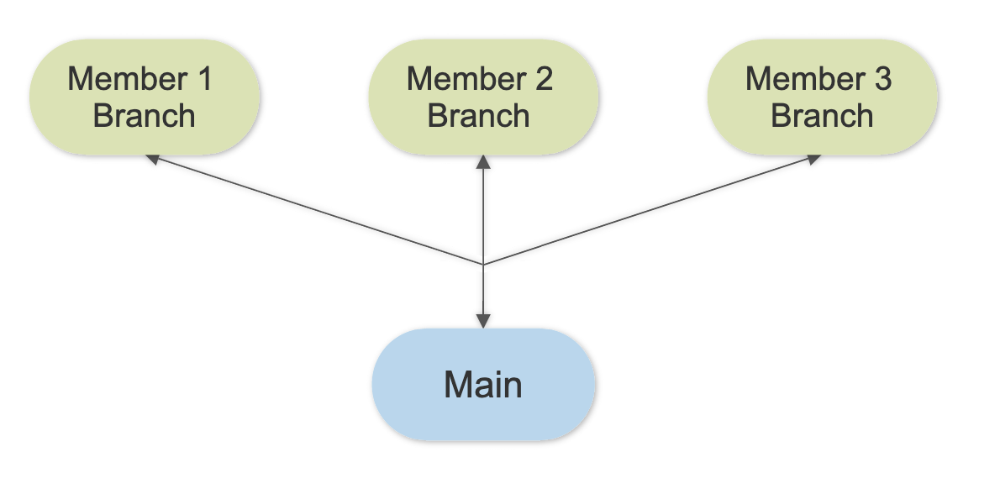
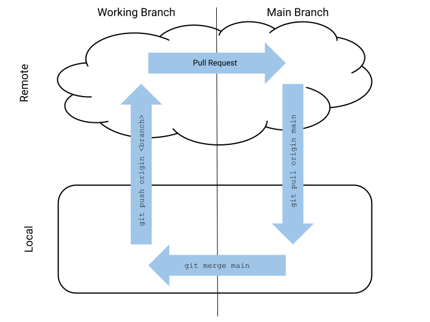

# Data Science: Sample Group Project Structure

## Key Takeaways

1. All individual work should be done within your personal "group member" folder.
2. All individual work should be done on your personal "group member" git branch.
3. Communication is key! Working on the same jupyter notebook at the same time will likely result in a merge conflict.
4. Don't Panic! A merge conflict is not the end of the world - let an instructor or coach know, and we will help you fix things up.

## Directory Structure

For this project we suggest the following directory structure:

```
project-folder
    ├── data-folder
    ├── images-folder
    ├── notebooks-folder
    |   |
    |   ├── group-member-1-notebooks-folder
    |   |   |
    |   |   └──group-member-1-working-notebook.ipynb
    |   |
    |   ├── group-member-2-notebooks-folder
    |   |   |
    |   |   └──group-member-2-working-notebook.ipynb
    |   |
    |   └── group-member-3-notebooks-folder
    |       |
    |       └──group-member-3-working-notebook.ipynb
    |
    ├── README.md
    ├── report-notebook.ipynb
    └── presentation.pdf
```

The goal here is that you are working only in your own folder. Never add/commit files that are in another member's folder!

## Git/GitHub Workflow

For this project, we suggest the following Git/GitHub workflow (a branching workflow):



The goal here is that you're working on your own branch. We recommend naming each branch after the group member.

The workflow should look like the following:

1. Pull the most recent updates from the remote `main` branch: `git pull origin main`
2. Move to your working branch locally: `git checkout <name of member branch>`
3. Merge the main branch onto your working branch: `git merge main`
4. Do the work! Make changes and edits to your project content!
5. Add and commit changes to your branch: `git add <file name>` then `git commit -m 'Meaningful message describing changes to be committed'`
6. Push changes to your remote working branch: `git push origin <name of member branch>`
7. Start a Pull Request on GitHub to sync changes on the working branch with the remote `main` branch
8. Repeat as necessary!

Steps 1, 3, 6 and 7 are represented on the arrows below:


